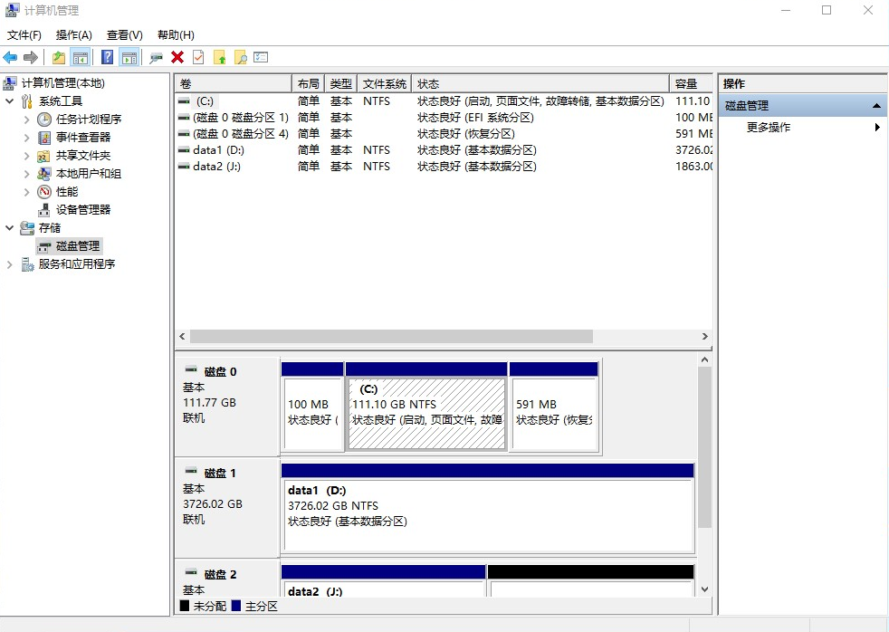
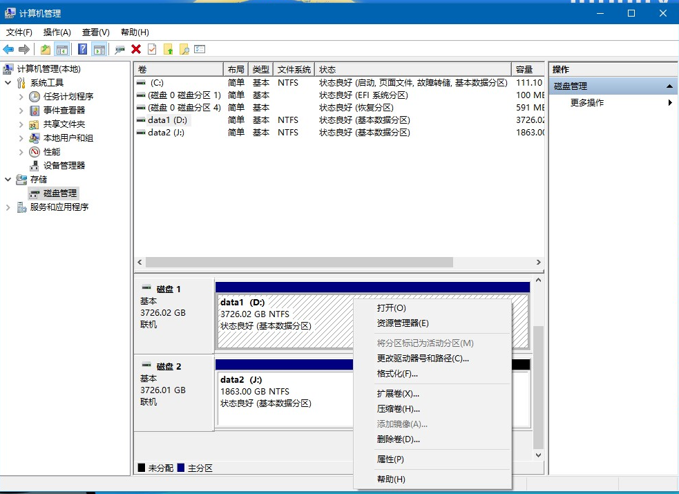

## 1.Windows系统的安装的准备工作

### 装机须知

1. 重装系统的影响范围：对于旧电脑的系统重装，安装程序主要修改的是系统盘（通常是C盘）的内容。原则上，这一过程不会直接删除或影响非系统盘（如D盘、E盘）的文件。此外，Windows 10安装程序通常会将旧系统的文件（如Windows.old文件夹）保留在系统盘根目录，以便回滚。
  - 重要提示：为了保证系统安装后的流畅运行及后续更新，系统盘（C盘）需要保留至少20GB的闲置空间（建议50GB以上为佳，10GB仅能保证基础运行，极易导致系统卡顿）。

2. 数据备份：虽然系统重装主要针对系统盘，但任何涉及磁盘分区的操作（如误删分区、格式化）或不可预见的意外（如断电、安装程序Bug）都可能导致数据丢失。因此，在开始任何操作前，务必将所有重要文件（包括桌面文件、文档、照片等）备份至移动硬盘、U盘或云盘。

### Windows磁盘管理

此步骤旨在为Windows系统的安装准备硬盘分区。如果是仅需重装系统且不改变系统盘大小的旧电脑，可跳过此步。
**操作路径：右键点击【此电脑】 - 选择【管理】 - 点击【磁盘管理】（初次加载可能需要等待几秒）。**

识别系统分区：如图所示，图中磁盘0是win10系统盘（C盘），系统盘（C盘）附近往往存在几个几百MB大小、类型为“系统”、“恢复”或“EFI”的分区。这些分区是Windows启动所必需的，请务必不要对其进行删除、格式化或修改操作。

磁盘操作：在此界面，右键点击某个分区（卷），可以对硬盘进行格式化、删除卷、压缩卷（从现有分区中拆分出未分配空间）或扩展卷（将未分配空间合并到现有分区）。通常，建议为Windows系统分配 100GB至150GB 的磁盘空间。

==磁盘数据丢失的补救：==
- 黄金原则：一旦发生误删文件或误格式化分区，**请立即停止对该磁盘进行任何写入操作**（包括新建文件、下载、安装软件等）。
- 原理：删除或格式化操作，本质上是移除了文件系统的“索引”，数据本身依然停留在磁盘扇区中。只有当新数据写入并覆盖这些扇区后，原文件才真正难以恢复。
- 恢复工具：在停止写入的前提下，可以使用专业的数据恢复软件（如 Recuva, DiskGenius 等）尝试扫描并恢复丢失的数据。

**特别注意：**如果你计划在新电脑上安装双系统（保留原系统，安装另一个新系统），请务必提前通过磁盘管理划分出足够的未分配空间，安装程序会在此空间内创建新系统的分区。

### Windows系统启动盘制作

微软官方提供了详细的指南：[为 Windows 创建安装媒体 - Microsoft 支持](https://support.microsoft.com/zh-cn/windows/为-windows-创建安装媒体-99a58364-8c02-206f-aa6f-40c3b507420d)

1. 准备材料：

  - 一个 8GB 或以上容量的U盘。
  - Windows 10 系统的 ISO 镜像文件（可从微软官网下载）。

2. 制作工具：推荐使用开源工具 Rufus，其兼容性好，制作成功率高。
Rufus软件： [Rufus-3.17](Windows_install/rufus-3.17.exe)

3. 操作步骤：

  - 重要警告：制作过程会格式化U盘，请提前备份U盘内所有个人数据。

  - 打开 Rufus 软件，在【设备】栏中选择你的U盘。

  - 点击【选择】，找到并选中下载好的 Windows 10 ISO 镜像文件。

  - 分区类型：对于2010年后出厂的大多数电脑，请选择 GPT；对于非常老的电脑（传统BIOS），选择 MBR。如果不确定，可优先尝试GPT。Rufus通常会自动识别并给出推荐。

  - 其他选项（卷标、文件系统）保持默认即可。

  - 点击【开始】，等待状态栏进度条走完即表示启动盘制作完成，关闭软件即可。

---

## 2. win10系统安装

1. 进入BIOS/UEFI并设置U盘启动：

  - 将制作好的系统盘插入待安装电脑的USB接口。

  - 按下开机键，并在屏幕亮起后立即、不间断地按特定快捷键进入BIOS/UEFI设置界面。常见按键为：F2, F10, F12, Del, Esc（具体取决于主板品牌，开机画面通常会有提示）。

  - 在BIOS界面中，找到 Boot（启动） 选项卡或类似选项。

  - 将U盘（通常显示为U盘品牌名或带有“USB”字样）设置为第一启动项。

  - 保存更改并退出（通常按F10），电脑将自动重启。

2. 开始安装：
  - 重启后，系统将从U盘引导，进入蓝色背景的Windows安装程序界面，点击【下一步】。

   

  - 点击【现在安装】。

   

  - 点击【我没有产品密钥】（可在安装完成后通过系统设置输入）。

   

  - 选择操作系统版本，推荐选择专业版，然后点击【下一步】

   

  -  勾选接受许可条款，点击【下一步】

   

  - 选择【自定义：仅安装Windows(高级)】

   

  - 此时会进入硬盘分区列表界面。这里需要极其谨慎：

  - - 情景一（新硬盘/准备充分）：如果之前在磁盘管理中预留了“未分配空间”，可以直接选中该空间，点击【下一步】，安装程序会自动在此创建必要分区并安装。

  - - 情景二（重装系统，覆盖旧C盘）：你需要根据分区大小和分区类型准确识别出旧的系统盘（C盘）。请务必再三确认（例如，原先C盘是100GB，这里看到一个100GB左右的主分区）。选中它，直接点击【下一步】。安装程序会提示“可能将旧文件移入Windows.old文件夹”，确认无误后继续。

  - - ⚠️ 风险提示：如果你不确定哪个分区是旧系统盘，或者哪个分区存有重要数据，请立即停止！ 此时应该退出安装程序，关机，并拔掉U盘。重启进入原系统后，打开磁盘管理再次确认分区布局和盘符对应关系。一旦在此处选错分区并进行安装，该分区的所有数据将被覆盖，极难恢复。

    

  - 等待安装程序运行

  - 安装完成后电脑会自动重启，此时需要拔掉U盘。重启后进入系统设置界面。
